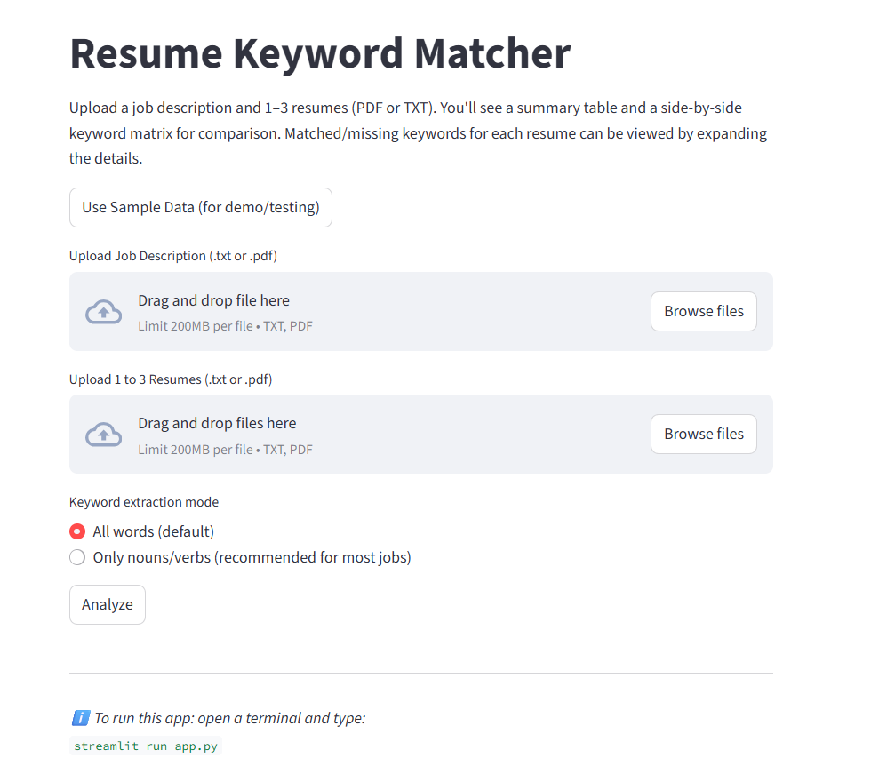

## Resume Keyword Matcher

*A Python tool to check how well your resume matches a job description using keyword comparison.*
---

# 🎯 **Try it live:** [Resume Keyword Matcher](https://resumekeywordmatcher-ck8izh5i2kdeatkwxjjvb2.streamlit.app/)
<p align="left">
  
</p>

---

## 📖 Project Overview

Landing an interview often depends on using the right keywords.  
The **Resume Keyword Matcher** takes the guesswork out of resume tailoring:

- **Upload a job description** and up to **three resumes** (PDF or TXT).  
- Instantly see **keyword matches**, **top gaps across resumes**, and an **overall match percentage**.  
- Explore a **keyword frequency matrix** to compare resumes side by side.  

This tool makes it easy for job seekers to **optimize resumes for specific postings** and improve their chances of getting noticed.

## ⭐ Features

- **Upload & Compare Resumes:** Upload **1–3 resumes** and a **job description** (PDF or TXT).  
- **Instant Keyword Analysis:** View **match percentage, matched keywords, and missing keywords** for each resume.  
- Top Gaps Across Resumes: Instantly see which important job keywords are missing most often  
- **Sample Data Demo:** Use built-in **sample resumes and job descriptions** for instant testing.  
- **Flexible Keyword Extraction:** Choose between **all keywords** or **nouns/verbs only** to focus on skills and actions.  
- **Interactive Streamlit UI:** Expandable previews, scrollable tables, and **real-time results**.  
- **Privacy-Friendly:** No external APIs or data storage—**all processing is in-memory**.  

## 🛠️ Tech Stack

| Technology          | Purpose                                                                 |
|---------------------|-------------------------------------------------------------------------|
| **Python 3.10+**    | Core language for text parsing, keyword extraction, and comparison logic |
| **Streamlit**       | Web app framework for interactive UI and easy cloud deployment           |
| **PyPDF2**          | Extracts text from uploaded PDFs, with multi-page and error handling     |
| **NLTK**            | Tokenization, stopword removal, and POS tagging (nouns/verbs mode)       |
| **Pandas**          | Builds keyword frequency matrices and summary tables efficiently        |
| **collections**     | Provides `Counter` for fast keyword frequency analysis                   |
| **io.BytesIO**      | Handles uploaded PDF files in memory                                    |
| **csv / os / pathlib** | Lightweight file handling for sample/demo data                       |
| **Streamlit Cloud** | Hosts the live demo; no servers or backend setup required                |
| **No External APIs**| Privacy-first; all processing is in-memory with no data storage          |

## ⚡ Installation / Local Setup Instructions

You can run the **Resume Keyword Matcher** locally in just a few steps.

---

### 1️⃣ Clone the Repository

```bash
git clone https://github.com/pasampat/resume_keyword_matcher.git
cd resume_keyword_matcher
```

### 🔹 2. Create a virtual environment
```python -m venv .venv
source .venv/bin/activate    # macOS/Linux
.venv\Scripts\activate       # Windows
```

### 🔹 3. Install dependencies
Make sure you have Python 3.10+
```
pip install -r requirements.txt
```

### 🔹 4. Run the App
```
streamlit run app.py
```
### 🔹 5. Test with Sample Files
Click **“Use Sample Data”** in the app to try the built‑in demo instantly.

Or upload your own **.txt** or **.pdf** resumes and job descriptions.

### 🔹 6. Troubleshooting
- **Dependency issues?**  
  Make sure your virtual environment is active and Python is **3.10+**.

- **PDF not reading correctly?**  
  Ensure it’s a **text-based PDF**.  
  (Scanned image PDFs are not supported by PyPDF2.)

- **Port conflict?**  
  If another app is using port **8501**, Streamlit will automatically assign a new port and display it in the terminal.


## 📂 Project Structure
```resume_keyword_matcher/
│├── test_files/         # Sample job descriptions and resumes for demo
│
├── app.py               # Main Streamlit app entry point
├── main.py              # Core logic for running the app
│
├── display_utils.py     # Helper functions for displaying results in Streamlit
├── file_utils.py        # File reading & PDF/TXT parsing utilities
├── text_utils.py        # Keyword extraction & text processing functions
│
├── stopwords.py         # Custom stopword list for keyword filtering
│
├── requirements.txt     # Python dependencies
├── README.md            # Project documentation
├── LICENSE              # MIT License
├── .gitignore           # Git ignore rules
└── .gitattributes       # Git attributes for text handling
```
## 📄 Sample Data

This project includes **sample files** to make it easy to try the app without uploading your own documents.

**Included in `test_files/`:**
- **Job Description:**  
  A sample job posting used to extract target keywords.
- **Resume 1 (PDF)** and **Resume 3 (TXT):**  
  Example resumes that might apply to the sample job.

**How It Works:**
- These sample resumes contain **some overlapping keywords** with the job description,  
  allowing you to instantly see **matched and missing keywords** in the analysis.
- Click **“Use Sample Data”** in the app to:
  1. Automatically load the sample job description and both resumes.
  2. Generate the **match summary**, **top gaps across resumes**, and **comparison matrix** without uploading anything.

**Tip:**  
Sample data is perfect for **first‑time users**, demos, or testing new features.


## 🚀 Usage Guide

Once the app is running (locally or via the [Live Demo](https://resumekeywordmatcher-ck8izh5i2kdeatkwxjjvb2.streamlit.app/)),  
follow these steps to analyze your resumes:

### 1️⃣ Upload Your Files
- **Job Description:** Upload a `.txt` or `.pdf` file with the job posting.
- **Resumes:** Upload **1–3 resumes** in `.txt` or `.pdf` format.
- *(Or click **“Use Sample Data”** to auto‑load the demo files.)*

### 2️⃣ Choose Keyword Extraction Mode
- **All Keywords:** Matches all cleaned words from the job description (default).
- **Nouns/Verbs Only:** Focuses on **skills and action words**, filtering out filler words.

### 3️⃣ Click **Analyze**
The app will process your files and show results in real‑time, including:

- **Match Summary Table:**  
  Match percentage, number of matched keywords, and missing keywords for each resume.
- **Top Gaps Across Resumes**  
  Expandable lists for each resume, sorted by keyword frequency in the job description.
- **Keyword Frequency Matrix:**  
  Side‑by‑side table showing how many times each job keyword appears in every resume.

### 4️⃣ Explore & Optimize
- Identify **missing keywords** to improve your resume.  
- Compare multiple resumes to see which is **best aligned** to the job posting.  
- Use insights to **tailor your application** for higher success.

## ⚠️ Error Handling & Limitations

The app is designed to **handle errors gracefully** and provide clear feedback for users.

### ✅ Supported Files
- **Job Description:** `.txt` or `.pdf`  
- **Resumes:** `.txt` or `.pdf` (up to **3 resumes per session**)  
- **Sample Data:** Built‑in job description + 2 sample resumes for instant testing

---

### 🔹 Error Handling
- **Unsupported File Types:** `.docx` or images are rejected with a clear error message.  
- **Unreadable PDFs:** Scanned/image‑based PDFs cannot be parsed by PyPDF2.  
- **Empty or Corrupted Files:** Skipped with a descriptive message (“Could not read file…”).  
- **Too Many Resumes:** Uploading 4+ resumes triggers a warning and stops analysis.  
- **Missing Required Files:** Analysis will not start until at least 1 JD + 1 resume are uploaded.

---

### 🔹 Known Limitations
- **PDF Extraction:** Works best with **digital PDFs** (not scans).  
- **Language Support:** Optimized for **English** job descriptions and resumes.  
- **Preview Length:** Only the **first ~5000 characters** are shown in UI for readability;  
  full text is still used for analysis.  

---

### 🔹 Common Issues

| Issue               | Cause                              | User Message                           |
|---------------------|------------------------------------|----------------------------------------|
| Wrong file type      | Uploading `.docx` or `.jpg`        | “Unsupported file type”                |
| Corrupted PDF        | Broken or scanned PDF              | “Error reading PDF: …”                 |
| Too many resumes     | 4+ resumes uploaded                | “Please upload no more than 3 resumes” |
| Missing file         | JD or resumes not uploaded         | “Please upload a job description”      |
| Empty/unreadable file| Blank or unreadable content        | “Could not read file…”                 |
